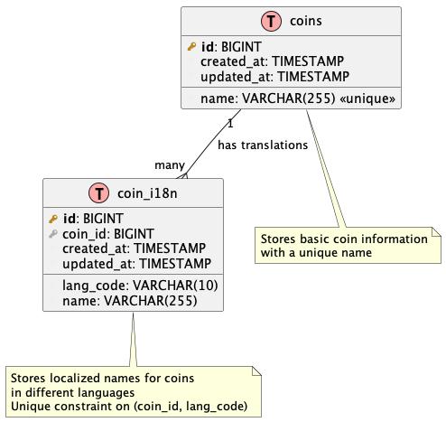

# Diagrams

This directory contains diagrams for the CoinDesk project.

## Viewing Diagrams

To view any diagram in this directory:

1. Open the provided PNG files directly for a quick reference

2. Or render the PlantUML source files yourself:
   - Install a PlantUML viewer/renderer:
     - IntelliJ IDEA has a PlantUML plugin
     - VS Code has PlantUML extension
     - Online viewer: [PlantUML Web Server](http://www.plantuml.com/plantuml/uml/)
   - Open the `.puml` file with your PlantUML viewer

## Updating Diagrams

When making changes to the project that affect diagrams:

1. Update the corresponding `.puml` file to reflect the changes
2. Re-render the diagram to generate an updated PNG
3. Replace the existing PNG file with the new version

This ensures both the source files and the rendered images stay in sync with the current project state.

## Current Diagrams

### Entity-Relationship Diagram

File: `CoinDesk_ER_Diagram.puml`

This diagram shows the database schema with:
- `coins` table with basic coin information
- `coin_i18n` table with internationalized names
- One-to-many relationship between coins and their translations
